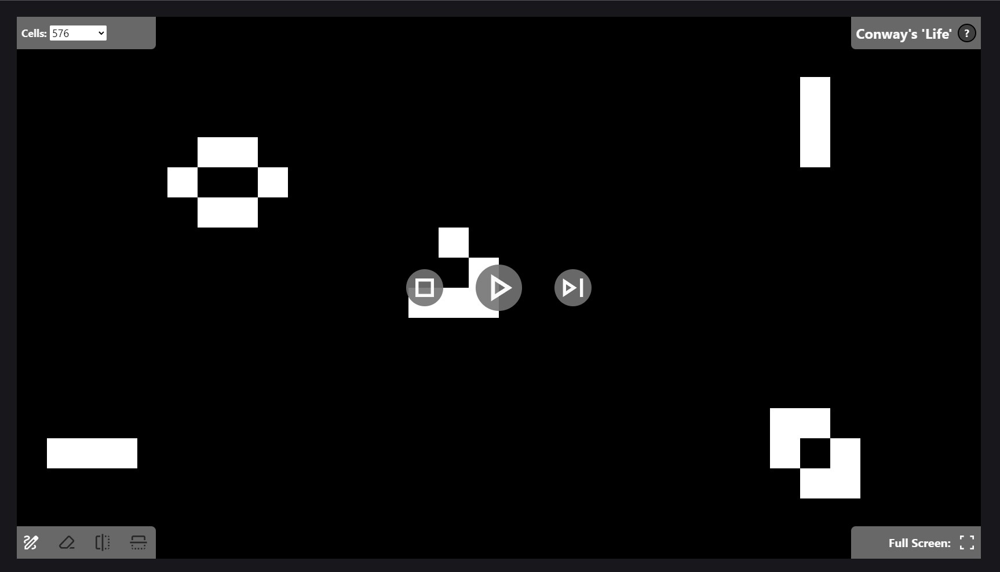

<!-- Improved compatibility of back to top link: See: https://github.com/othneildrew/Best-README-Template/pull/73 -->
<a name="readme-top"></a>

<!-- PROJECT LOGO -->
<br />
<div align="center">
  <a href="https://github.com/jrbarnhart/game-of-life">
    
  </a>

<h3 align="center">John Conway's Game of Life</h3>

  <p align="center">
    This is a simple implementation of John Conway's Game of Life, also known as simply Life. It is a cellular automaton, or simulation.
    <br />
    <br />
    <a href="https://conway-life-simulation.netlify.app/">View Demo</a>
    ·
    <a href="https://github.com/jrbarnhart/game-of-life/issues/new?labels=bug&template=bug-report---.md">Report Bug</a>
  </p>
</div>


<!-- TABLE OF CONTENTS -->
<details>
  <summary>Table of Contents</summary>
  <ol>
    <li>
      <a href="#about-the-project">About The Project</a>
      <ul>
        <li><a href="#built-with">Built With</a></li>
      </ul>
    </li>
    <li>
      <a href="#getting-started">Getting Started</a>
      <ul>
        <li><a href="#prerequisites">Prerequisites</a></li>
        <li><a href="#installation">Installation</a></li>
      </ul>
    </li>
    <li><a href="#license">License</a></li>
    <li><a href="#contact">Contact</a></li>
  </ol>
</details>


<!-- ABOUT THE PROJECT -->
## About The Project

[](https://conway-life-simulation.netlify.app/)

My aim with this project was to create a Life simulation capable of simulating a large number of cells at a target of 10fps. I also included the ability to determine the initial state by drawing cells to the grid before starting the simulation.

The performance was achieved through my approach to implementing Life's rules, which themselves are simple:
1. For every cell, consider the cell's 8 adjacent neighbors on the grid.
2. If the cell is dead and has exactly three living neighbors then it comes to life.
3. If the cell is alive and has less than 2 or more than 3 living neighbors it dies.

For example, consider the following grid:


The naive apporach to implementing these rules would be to apply them to every single cell for every single frame. This will work, but you end up with a many to many comparison. This means that adding more cells increases the computation time exponentially. This is illustrated in the grid below. 

(Note: the arrows are just for illustration. All 8 neighbors per cell are considered in the rules.)


That is a lot of calculations! There is a better way, but it requires some setup. First I store every cell's data as an unsigned 8 bit integer in a Uint8 array. This is done by using the most significant bit to track if the cell is alive or dead, and the last four bits to track how many living neighbors it has.

For example, a cell that is alive with three living neighbors will have the binary value of 10000011, or 131 as a Uint8.

When the simulation starts all cells have their neighbors stored. This only needs to be done once.


Now that the cell data has been initialized with their living neighbor counts we can take a shortcut. Instead of every cell we can focus on just the living cells and use a slightly different algorithm:
1. If the cell has less than 2 or more than 3 living neighbors then it dies.
2. If the cell dies then update it's neighbor's living neighbor count values.
3. If any any of the cell's neighbors now have exactly 3 living neighbors then they come to life.
4. Repeat from step 2 for any neighbor cells that come to life.

This recursive approach means most dead cells are never touched for most frames which prevents many useless calculations that result in no changes.


I wanted to avoid subpixel rendering so I limit the max grid resolution to the smallest canvas size resolution that I support, which is 384 x 216 for a total of 82,944 cells. This means the smallest cell will ever be is one pixel. However this is a graphical limitation only. Depending on the hardware running the simulation, the algorithm can handle more cells. In initial states with many living cells things can be a bit slower but as soon as most cells die off and the grid is sparse performance improves dramatically.

<p align="right">(<a href="#readme-top">back to top</a>)</p>


### Built With

* Typescript
* React
* Vite
* Tailwind
* Vitest

<p align="right">(<a href="#readme-top">back to top</a>)</p>


<!-- GETTING STARTED -->
## Getting Started

To get a local copy up and running follow these simple example steps.

### Prerequisites

Note: Requires Node.js to run locally.

* npm
  ```sh
  npm install npm@latest -g
  ```

### Installation

1. Clone the repo
   ```sh
   git clone https://github.com/jrbarnhart/game-of-life.git
   ```
2. Install NPM packages
   ```sh
   npm install
   ```
3. Start the dev server
   ```sh
   npm run dev
   ```
4. Navigate to the address in the terminal

<p align="right">(<a href="#readme-top">back to top</a>)</p>

<!-- LICENSE -->
## License

Distributed under the MIT License. See `LICENSE.txt` for more information.

<p align="right">(<a href="#readme-top">back to top</a>)</p>


<!-- CONTACT -->
## Contact

Joshua Barnhart - joshua.r.barnhart@gmail.com

[LinkedIn](https://linkedin.com/in/joshuarbarnhart)

Project Link: [https://github.com/jrbarnhart/game-of-life](https://github.com/jrbarnhart/game-of-life)

<p align="right">(<a href="#readme-top">back to top</a>)</p>


